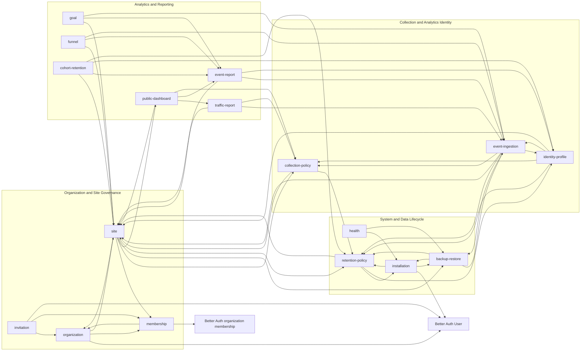

# Resource Dependency Graph

This is the cross-resource dependency index for the normative resource
specifications. The resource `SPECS.md` files remain authoritative; this
document does not introduce new contract behavior.

## Reading the Graph

An arrow points from a resource to a resource it depends on:

```text
consumer --> dependency
```

The graph is intentionally not a DAG. Lifecycle, authorization, collection,
and reporting resources have reciprocal relationships that form cycles.



## Edge Index

The following edges are transcribed from each resource's `Depends On` table.
The source link points to the corresponding related-resources section.

| Consumer            | Dependency                          | Integration point                                                                        | Source                                                                                                             |
| ------------------- | ----------------------------------- | ---------------------------------------------------------------------------------------- | ------------------------------------------------------------------------------------------------------------------ |
| `installation`      | Better Auth User                    | Admin principal.                                                                         | [installation](./system-data-lifecycle/installation/SPECS.md#11-related-resources--dependencies)                   |
| `installation`      | `retention-policy`                  | Installation default.                                                                    | [installation](./system-data-lifecycle/installation/SPECS.md#11-related-resources--dependencies)                   |
| `installation`      | `backup-restore`                    | Maintenance state.                                                                       | [installation](./system-data-lifecycle/installation/SPECS.md#11-related-resources--dependencies)                   |
| `health`            | `installation`                      | Installation state.                                                                      | [health](./system-data-lifecycle/health/SPECS.md#11-related-resources--dependencies)                               |
| `health`            | `backup-restore`                    | Quiesce/recovery state.                                                                  | [health](./system-data-lifecycle/health/SPECS.md#11-related-resources--dependencies)                               |
| `retention-policy`  | `installation`                      | Default and operating envelope.                                                          | [retention-policy](./system-data-lifecycle/retention-policy/SPECS.md#11-related-resources--dependencies)           |
| `retention-policy`  | `site`                              | Optional override.                                                                       | [retention-policy](./system-data-lifecycle/retention-policy/SPECS.md#11-related-resources--dependencies)           |
| `retention-policy`  | `identity-profile`                  | Deletion and profile retention.                                                          | [retention-policy](./system-data-lifecycle/retention-policy/SPECS.md#11-related-resources--dependencies)           |
| `backup-restore`    | `installation`                      | Maintenance and readiness state.                                                         | [backup-restore](./system-data-lifecycle/backup-restore/SPECS.md#11-related-resources--dependencies)               |
| `backup-restore`    | `retention-policy`                  | Restore and post-restore lifecycle.                                                      | [backup-restore](./system-data-lifecycle/backup-restore/SPECS.md#11-related-resources--dependencies)               |
| `backup-restore`    | `event-ingestion`                   | Quiesce and flush boundary.                                                              | [backup-restore](./system-data-lifecycle/backup-restore/SPECS.md#11-related-resources--dependencies)               |
| `organization`      | Better Auth User                    | Authenticated principal and User identity.                                               | [organization](./organization-site-governance/organization/SPECS.md#11-related-resources--dependencies)            |
| `organization`      | `membership`                        | Persisted Organization access.                                                           | [organization](./organization-site-governance/organization/SPECS.md#11-related-resources--dependencies)            |
| `organization`      | `site`                              | Deletion guard.                                                                          | [organization](./organization-site-governance/organization/SPECS.md#11-related-resources--dependencies)            |
| `membership`        | Better Auth organization membership | Membership persistence and principal identity.                                           | [membership](./organization-site-governance/membership/SPECS.md#11-related-resources--dependencies)                |
| `membership`        | `organization`                      | Organization lifecycle.                                                                  | [membership](./organization-site-governance/membership/SPECS.md#11-related-resources--dependencies)                |
| `invitation`        | `organization`                      | Target Organization lifecycle.                                                           | [invitation](./organization-site-governance/invitation/SPECS.md#11-related-resources--dependencies)                |
| `invitation`        | `membership`                        | Atomic membership creation.                                                              | [invitation](./organization-site-governance/invitation/SPECS.md#11-related-resources--dependencies)                |
| `invitation`        | Better Auth User                    | Authentication and Organization membership authority for the authenticated recipient.    | [invitation](./organization-site-governance/invitation/SPECS.md#11-related-resources--dependencies)                |
| `site`              | `organization`                      | Persisted ownership and authorization.                                                   | [site](./organization-site-governance/site/SPECS.md#11-related-resources--dependencies)                            |
| `site`              | `membership`                        | Persisted ownership and authorization.                                                   | [site](./organization-site-governance/site/SPECS.md#11-related-resources--dependencies)                            |
| `site`              | `collection-policy`                 | Site collection settings.                                                                | [site](./organization-site-governance/site/SPECS.md#11-related-resources--dependencies)                            |
| `site`              | `public-dashboard`                  | Public identifier and disclosure configuration.                                          | [site](./organization-site-governance/site/SPECS.md#11-related-resources--dependencies)                            |
| `site`              | `backup-restore`                    | Global lifecycle lock, tombstone-authoritative restore, and historical backup retention. | [site](./organization-site-governance/site/SPECS.md#11-related-resources--dependencies)                            |
| `site`              | `retention-policy`                  | Normal retention continues during the recoverable deletion window.                       | [site](./organization-site-governance/site/SPECS.md#11-related-resources--dependencies)                            |
| `collection-policy` | `site`                              | Site scope and owner.                                                                    | [collection-policy](./collection-analytics-identity/collection-policy/SPECS.md#11-related-resources--dependencies) |
| `collection-policy` | `retention-policy`                  | Effective retention and deletion behavior.                                               | [collection-policy](./collection-analytics-identity/collection-policy/SPECS.md#11-related-resources--dependencies) |
| `event-ingestion`   | `site`                              | Ingestion Identifier and Site scope.                                                     | [event-ingestion](./collection-analytics-identity/event-ingestion/SPECS.md#12-related-resources--dependencies)     |
| `event-ingestion`   | `collection-policy`                 | Ordered exclusions and sanitization.                                                     | [event-ingestion](./collection-analytics-identity/event-ingestion/SPECS.md#12-related-resources--dependencies)     |
| `event-ingestion`   | `identity-profile`                  | Explicit identity context and deletion policy.                                           | [event-ingestion](./collection-analytics-identity/event-ingestion/SPECS.md#12-related-resources--dependencies)     |
| `event-ingestion`   | `retention-policy`                  | Event lifecycle.                                                                         | [event-ingestion](./collection-analytics-identity/event-ingestion/SPECS.md#12-related-resources--dependencies)     |
| `event-ingestion`   | `backup-restore`                    | Durable acceptance-journal capture and recovery.                                         | [event-ingestion](./collection-analytics-identity/event-ingestion/SPECS.md#12-related-resources--dependencies)     |
| `identity-profile`  | `site`                              | Site scope and Ingestion Identifier.                                                     | [identity-profile](./collection-analytics-identity/identity-profile/SPECS.md#11-related-resources--dependencies)   |
| `identity-profile`  | `collection-policy`                 | Consent, opt-in, and property limits.                                                    | [identity-profile](./collection-analytics-identity/identity-profile/SPECS.md#11-related-resources--dependencies)   |
| `identity-profile`  | `event-ingestion`                   | Shared identity validation and Event context.                                            | [identity-profile](./collection-analytics-identity/identity-profile/SPECS.md#11-related-resources--dependencies)   |
| `identity-profile`  | `retention-policy`                  | Profile and derived-result lifecycle.                                                    | [identity-profile](./collection-analytics-identity/identity-profile/SPECS.md#11-related-resources--dependencies)   |
| `traffic-report`    | `site`                              | Scope and ownership.                                                                     | [traffic-report](./analytics-reporting/traffic-report/SPECS.md#11-related-resources--dependencies)                 |
| `traffic-report`    | `event-ingestion`                   | Pageviews and accepted Event data.                                                       | [traffic-report](./analytics-reporting/traffic-report/SPECS.md#11-related-resources--dependencies)                 |
| `traffic-report`    | `collection-policy`                 | Stored dimensions and exclusions.                                                        | [traffic-report](./analytics-reporting/traffic-report/SPECS.md#11-related-resources--dependencies)                 |
| `event-report`      | `event-ingestion`                   | Accepted Event envelope.                                                                 | [event-report](./analytics-reporting/event-report/SPECS.md#11-related-resources--dependencies)                     |
| `event-report`      | `identity-profile`                  | Profile fields and deletion state.                                                       | [event-report](./analytics-reporting/event-report/SPECS.md#11-related-resources--dependencies)                     |
| `event-report`      | `site`                              | Authorization scope.                                                                     | [event-report](./analytics-reporting/event-report/SPECS.md#11-related-resources--dependencies)                     |
| `goal`              | `site`                              | Scope and ownership.                                                                     | [goal](./analytics-reporting/goal/SPECS.md#11-related-resources--dependencies)                                     |
| `goal`              | `event-report`                      | Standard action semantics.                                                               | [goal](./analytics-reporting/goal/SPECS.md#11-related-resources--dependencies)                                     |
| `goal`              | `event-ingestion`                   | Shared server-authoritative Analytics Session boundaries.                                | [goal](./analytics-reporting/goal/SPECS.md#11-related-resources--dependencies)                                     |
| `funnel`            | `site`                              | Scope and ownership.                                                                     | [funnel](./analytics-reporting/funnel/SPECS.md#11-related-resources--dependencies)                                 |
| `funnel`            | `event-report`                      | Standard action matching.                                                                | [funnel](./analytics-reporting/funnel/SPECS.md#11-related-resources--dependencies)                                 |
| `funnel`            | `event-ingestion`                   | Shared server-authoritative Analytics Session boundaries.                                | [funnel](./analytics-reporting/funnel/SPECS.md#11-related-resources--dependencies)                                 |
| `cohort-retention`  | `site`                              | Scope and ownership.                                                                     | [cohort-retention](./analytics-reporting/cohort-retention/SPECS.md#11-related-resources--dependencies)             |
| `cohort-retention`  | `event-report`                      | Action matching.                                                                         | [cohort-retention](./analytics-reporting/cohort-retention/SPECS.md#11-related-resources--dependencies)             |
| `cohort-retention`  | `identity-profile`                  | Identified-user context and deletion.                                                    | [cohort-retention](./analytics-reporting/cohort-retention/SPECS.md#11-related-resources--dependencies)             |
| `cohort-retention`  | `retention-policy`                  | Data availability horizon.                                                               | [cohort-retention](./analytics-reporting/cohort-retention/SPECS.md#11-related-resources--dependencies)             |
| `public-dashboard`  | `site`                              | Ownership, identifier, and lifecycle.                                                    | [public-dashboard](./analytics-reporting/public-dashboard/SPECS.md#11-related-resources--dependencies)             |
| `public-dashboard`  | `traffic-report`                    | Approved aggregate source concepts, never direct route reuse.                            | [public-dashboard](./analytics-reporting/public-dashboard/SPECS.md#11-related-resources--dependencies)             |
| `public-dashboard`  | `event-report`                      | Approved aggregate source concepts, never direct route reuse.                            | [public-dashboard](./analytics-reporting/public-dashboard/SPECS.md#11-related-resources--dependencies)             |
| `public-dashboard`  | `collection-policy`                 | Sensitive data and field exclusions.                                                     | [public-dashboard](./analytics-reporting/public-dashboard/SPECS.md#11-related-resources--dependencies)             |

## Scope Notes

- The graph contains 17 first-party resource nodes and 52 first-party edges.
- Better Auth is shown as an external dependency because it is named in the
  resource specs but is not a Cimi resource.
- `Used By` tables are reverse indexes of the same relationships. Aggregate
  entries such as `All analytics resources` and conditional entries such as
  `Only if an approved aggregate metric is later included` remain expressed in
  their source specs rather than being expanded into guessed edges here.
- External consumers named by `Used By` tables, such as operators and frontend
  dashboards, are not resource nodes in this graph.
